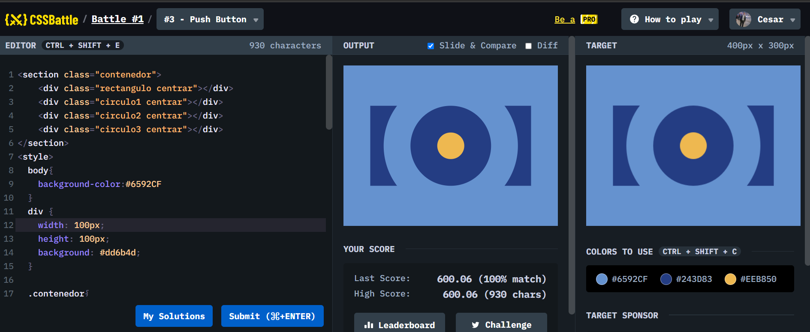

# Apuntes

* Las clases son mas recomendadas usarlas en CSSsin embargo los ID son mas recomendadas para utilizarlas para javascript.
* El ID esta sobre la clase, y las Tags estan sobre las ID.

* Es recomendable utilizar los diversas etiquetas de HTML tales como Nav, Secction, Header, Footer con la manera de hacer nuestra pagina mas entendible. Los div hay que utilizarlos cuando queremos encapsular algunas cosas.

* Hay que utilizar las clases para poder reutilizarlas en diferentes elementos de HTML, por ejemplo, podemos hacer una clase que se llame centrar y va a tener lo siguiente.

.centrar {

    position:absolute;

    top; 50%;

    left:50%;

  }

* Y esto lo podemos utilizar para centrar elementos, y lo podemos poner en un div, y a su ves lo podemos poner en otro div, y en el header para centrar todo el header, o toda la imagen,, etc. ESTO EN LA MAYOR PARTE DE LAS VESES SUCEDE CUANDO HAY UNA CARACTERISTICA QUE SE COMPARTE.
* Transform -> transform: translate(-50%, -50%); lo que nos permite es poner cosas encima de otras.

  
* Con estas practicas, sirven para saber poner cosas encimas de otra.
